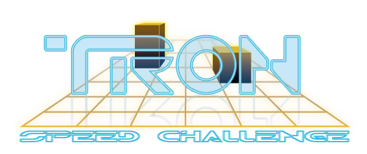
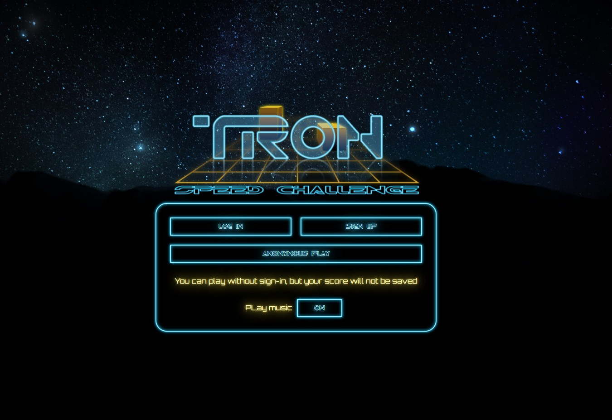
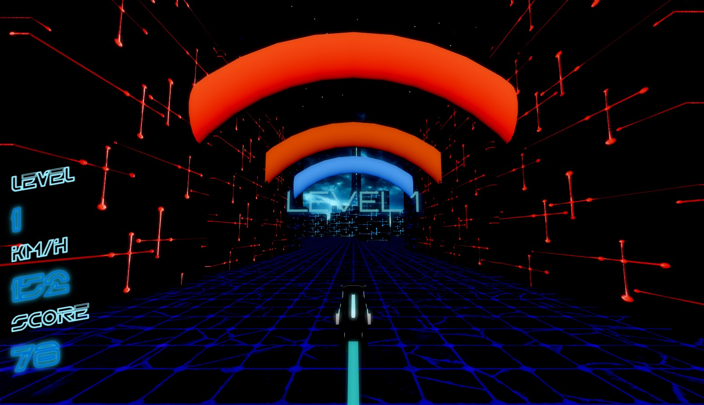
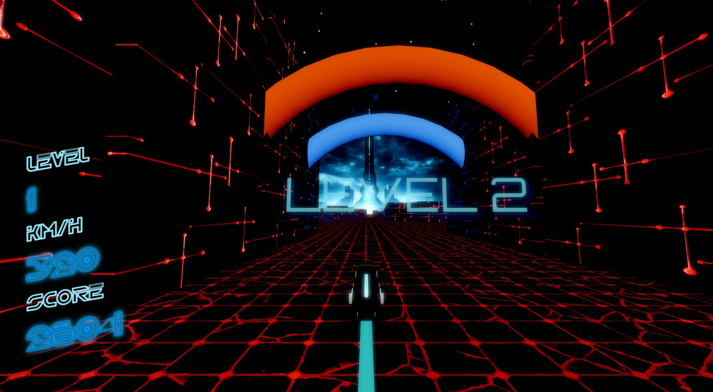

Avoid the cubes while the speed progressively increases! <b>Can you set a record?</b>

____

# Welcome to the Tron Game

The game is inspired by an old flash game the late 2000s and film The Tron. Our version is in full 3D and built with React, THREE.js, react-three-drei and react-three-fiber to glue them together.

Deploy [Tron Game](https://rsclone-tron-game.netlify.app/).

____

## Screenshots

____

## Controls

* Left: A, LeftArrow

* Right: D, RightArrow

Touch devices have on-screen controls.

____

# Backend

[Server](https://github.com/ViktorElenich/cuberun-server)

### Stack:

  

&nbsp;
&nbsp;
&nbsp;
&nbsp;
&nbsp;
&nbsp;
&nbsp;
&nbsp;
